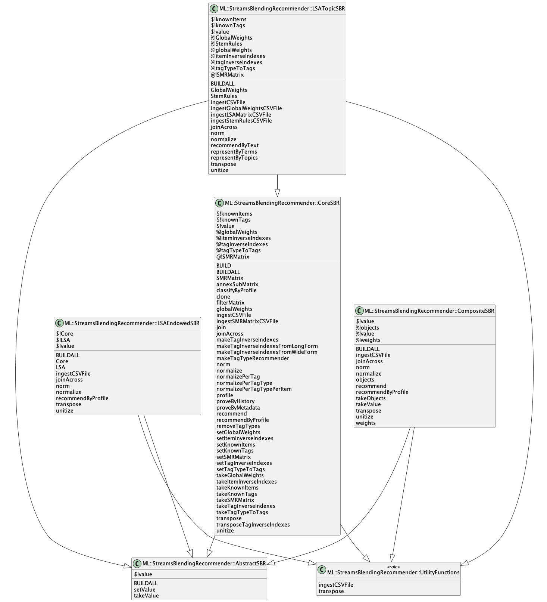

# Raku Streams Blending Recommender

[](http://sparrowhub.io:2222)
[](https://www.gnu.org/licenses/gpl-3.0)

Raku implementation of a Streams Blending Recommender (SBR) framework.

Generally speaking, SBR is a "computer scientist" implementation of a recommendation system
based on sparse linear algebra. See the article
["Mapping Sparse Matrix Recommender to Streams Blending Recommender"](https://github.com/antononcube/MathematicaForPrediction/tree/master/Documentation/MappingSMRtoSBR),
[AA1], for detailed theoretical description of the data structures and operations with them.

This implementation is loosely based on the:

- Software monad
["MonadicSparseMatrixRecommender"](https://github.com/antononcube/MathematicaForPrediction/blob/master/MonadicProgramming/MonadicSparseMatrixRecommender.m), [AAp1],
in Mathematica

- Software monad ["SMRMon-R"](https://github.com/antononcube/R-packages/tree/master/SMRMon-R), [AAp2], in R

- Object-Oriented Programming (OOP) implementation
["SparseMatrixRecommender"](https://pypi.org/project/SparseMatrixRecommender/), [AAp3], in Python


Instead of "monads" the implementations in this package and [AAp3] use OOP classes. 
Instead of "monadic pipelines" method chaining is used. 

See the org-mode file 
["Work-plan.org"](./org/Work-plan.org)
for detailed status (including a TODO list.)

--------

## Installation

From GitHub:

```shell
zef install https://github.com/antononcube/Raku-ML-StreamsBlendingRecommender.git
```

From zef-ecosystem:

```shell
zef install ML::StreamsBlendingRecommender
```

--------

## Usage 

In this section we show how to use the package by making a (nearest neighbors) classifier with it.

Here are the steps:

1. Take an example dataset
    
   - Titanic data from "Data::Reshapers", [AAp4].

2. Make a recommender for that dataset

3. Use the `classify` method of the recommender over a random selection of rows.

   - Classify for the labels "died" or "survived" of Titanic's dataset column "passengerAge".  

4. Evaluate the classification results 
  
   - Using Receiver Operating Characteristic (ROC) statistics via "ML::ROCFunctions", [AAp5].

```perl6
use Data::Reshapers;
use Data::Summarizers;
my @dsTitanic = get-titanic-dataset();
records-summary(@dsTitanic)
```

Here is a sample of the data:

```perl6
to-pretty-table(@dsTitanic.roll(4));
```

Here we make the recommender object:

```perl6
use ML::StreamsBlendingRecommender;

my ML::StreamsBlendingRecommender::CoreSBR $sbrObj .= new;

$sbrObj.makeTagInverseIndexesFromWideForm(@dsTitanic, tagTypes => @dsTitanic[0].keys.grep({ $_ ne 'id' }).Array, itemColumnName => <id>, :!addTagTypesToColumnNames).transposeTagInverseIndexes;
```

Here we classify by profile

```perl6
$sbrObj.classifyByProfile('passengerSurvival', ['1st', 'female']):!object
```

**Remark:** Since we want to see the result and "dot-chain" with further method call we use
the adverb `:!object`.

Here are the classification results of 5 randomly selected rows from the dataset:

```perl6
my @clRes = @dsTitanic.pick(5).map({ $sbrObj.classifyByProfile('passengerSurvival', $_<passengerAge passengerClass passengerSex>):!object }).Array;
```

*TBF...*


-------

## Implementation

### UML diagram

Here is a UML diagram that shows package's structure:



The
[PlantUML spec](./resources/class-diagram.puml)
and
[diagram](./resources/class-diagram.png)
were obtained with the CLI script `to-uml-spec` of the package "UML::Translators", [AAp6].

Here we get the [PlantUML spec](./resources/class-diagram.puml):

```shell
to-uml-spec ML::StreamsBlendingRecommender > ./resources/class-diagram.puml
```

Here get the [diagram](./resources/class-diagram.png):

```shell
to-uml-spec ML::StreamsBlendingRecommender | java -jar ~/PlantUML/plantuml-1.2022.5.jar -pipe > ./resources/class-diagram.png
```

## Object-oriented design


--------


## References

### Articles

[AA1] Anton Antonov, 
["Mapping Sparse Matrix Recommender to Streams Blending Recommender"](https://github.com/antononcube/MathematicaForPrediction/tree/master/Documentation/MappingSMRtoSBR), 
(2019),
[GitHub/antononcube](https://github.com/antononcube).

### Packages, repositories

[AAp1] Anton Antonov,
[Monadic Sparse Matrix Recommender Mathematica package](https://github.com/antononcube/MathematicaForPrediction/blob/master/MonadicProgramming/MonadicSparseMatrixRecommender.m),
(2018),
[GitHub/antononcube](https://github.com/antononcube/).

[AAp2] Anton Antonov,
[Sparse Matrix Recommender Monad R package](https://github.com/antononcube/R-packages/tree/master/SMRMon-R),
(2018),
[R-packages at GitHub/antononcube](https://github.com/antononcube/R-packages).

[AAp3] Anton Antonov,
[SparseMatrixRecommender Python package](https://github.com/antononcube/Python-packages/tree/main/SparseMatrixRecommender),
(2021),
[Python-packages at GitHub/antononcube](https://github.com/antononcube/Python-packages).

[AAp4] Anton Antonov,
[Data::Reshapers Raku package](https://github.com/antononcube/Raku-Data-Reshapers),
(2021),
[GitHub/antononcube](https://github.com/antononcube).

[AAp5] Anton Antonov,
[ML::ROCFunctions Raku package](https://github.com/antononcube/Raku-ML-ROCFunctions),
(2022),
[GitHub/antononcube](https://github.com/antononcube).

[AAp6] Anton Antonov,
[UML::Translators Raku package](https://github.com/antononcube/Raku-UML-Translators),
(2022),
[GitHub/antononcube](https://github.com/antononcube).