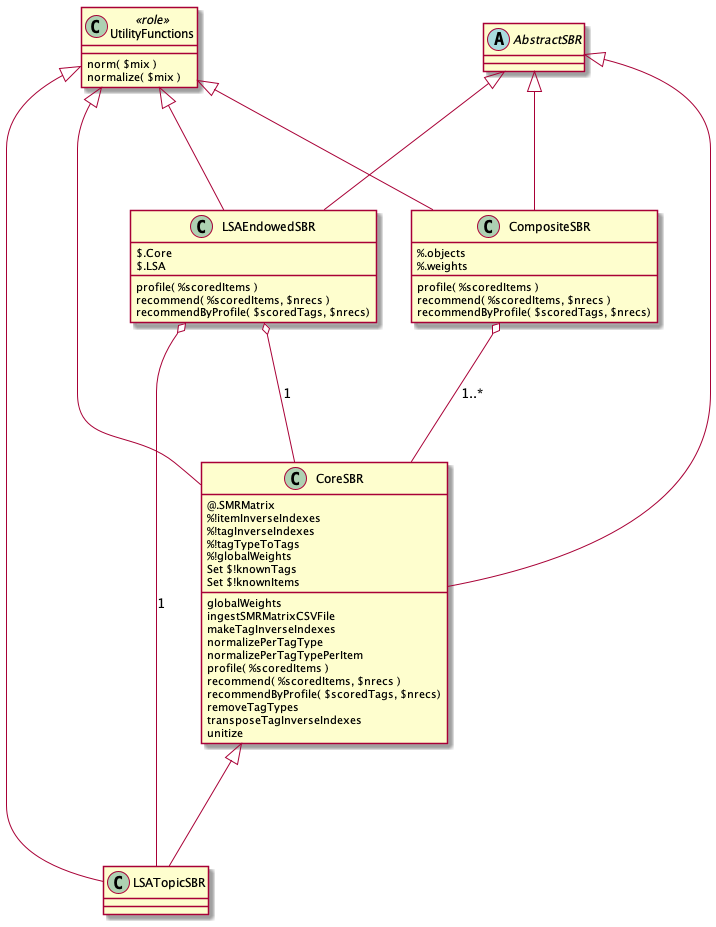
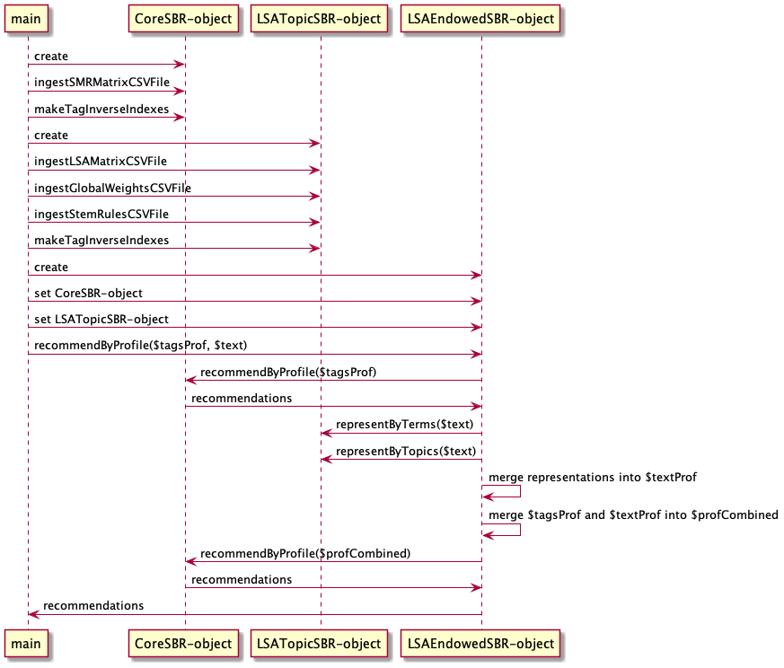

# Explanations

This folder has documents and diagrams that explain different aspects of the
Streams Blending Recommender (SBR). 

## UML diagrams

The UML diagrams below were made using 
[PlantUML](https://plantuml.com) 
and the IntelliJ IDEA plugin
[PlantUML integration](https://plugins.jetbrains.com/plugin/7017-plantuml-integration).

Here is a UML class diagram for the classes in the package 
([puml](./PlantUML/ClassDependencies.puml)):

Here is a sequence diagram for computing recommendations in the "main" use case
([puml](./PlantUML/RunSequence.puml)):

